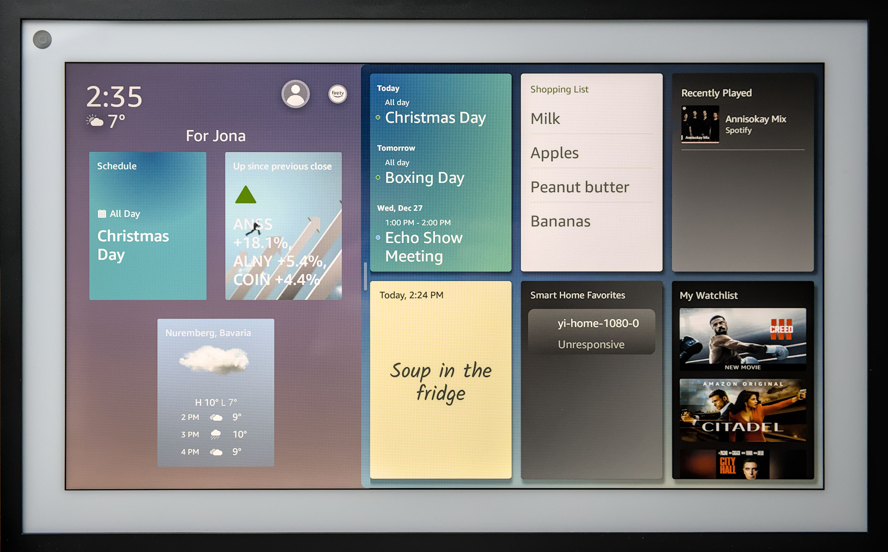

# *Started Off Local, Now We're in the Cloud*: Forensic Examination of the Amazon Echo Show 15 Smart Display

<a href="./docs/assets/IMG_0494_edit.jpg">

</a>

## Table of Contents
- [Hardware](./docs/hardware.md)
  - [Micro USB](./docs/micro-usb.md)
  - [UART](./docs/uart.md)
  - [eMMC Interface and Partitions](./docs/emmc.md)
  - [Micro HDMI](./docs/micro-hdmi.md)
- [Filesystem](./docs/filesystem/)
  - [Log Files](./docs/filesystem/log-files.md)
- [Decryption of Token Database](./docs/filesystem/token-db.md)
- [Companion Apps](./docs/companion-apps.md)
- [Alexa API](./docs/api.md)
  - [Authentication](./docs/api.md#authentication)
  - [GraphQL](./docs/api.md#graphql)

## General Notes
- We had two Echo Show 15 smart displays at our disposal. The first one was used
  between October 2022 and January 2023. The second one was used from February
  2023 until August 2023. They show up in some [API](./docs/api.md) responses as
  *"ForensicEcho20221120"* and *"ForensicEcho20230223"*.
- When comparing time stamps, winter and summer time should be taken into
  account. The devices were located in Germany.

## Paper

Our paper was presented at the 24th Annual _Digital Forensics Research Conference USA_ ([DFRWS USA 2024](https://dfrws.org/presentation/started-off-local-now-were-in-the-cloud-forensic-examination-of-the-amazon-echo-show-15-smart-display/)):

> Jona Crasselt and Gaston Pugliese.
> [_Started Off Local, Now We're in the Cloud_: Forensic Examination of the Amazon Echo Show 15 Smart Display](https://dfrws.org/wp-content/uploads/2024/07/dfrws-usa-2024-echo-show-15.pdf). Digital Forensics Research Conference USA (DFRWS USA 2024).

<details>
<summary><b>BibTeX</b></summary>

```bibtex
@inproceedings{crasselt2024echo, 
    title = {{Started Off Local, Now We’re in the Cloud: Forensic Examination of the Amazon Echo Show 15 Smart Display}}, 
    author = {Jona Crasselt and Gaston Pugliese}, 
    year = {2024}, 
    booktitle = {{Digital Forensics Research Conference USA (DFRWS USA 2024)}}, 
    url = {https://dfrws.org/wp-content/uploads/2024/07/dfrws-usa-2024-echo-show-15.pdf} 
}
```

</details>