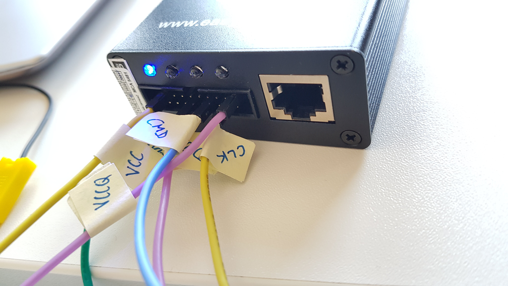

# eMMC

## Interface on PCB

After we unsoldered the eMMC from the MLB we were able to measure for continuity
between test points on the PCB and the eMMC contacts. The following pictures
show the identified eMMC interface. It should be mentioned, that the
CMD channel has no dedicated test point, but can be accessed on the side of an
SMD resistor.

<table>
<tr>
<td>
<a href="./assets/pcb_mlb_back_tp-emmc_sm.svg">

</a>
</td><td>
<a href="./assets/pcb_mlb_front_contacts-emmc_pretty.svg">

</a>
</td>
</tr>
</table>

|Channel|Description|
|---    |---        |
|CLK|Clock signal|
|CMD|Bidirectional command line|
|D0-7|Bidirectional data lines|
|VCC|Input voltage for flash storage (3.3V)|
|VCCQ|Input voltage for controller (1.8V)|
|VSS(Q)|Ground|


The following pictures show our setup: Needle probes were placed on the test
points and connected to the EasyJTAG.
<a href="./assets/PXL_20230804_114641777.jpg">

</a>

<a href="./assets/20230503_162759.jpg">

</a>

## EasyJTAG Settings

EasyJTAG Classic Suite Settings:
- **Pinout Mode**: EasyJTAG2/E-Socket
- **CLK Rate**: 1MHz *(We assume that the clock rate cannot exceed 1MHz due to the wire length)*
- **IO Voltage**: 1.8 Volt IO
- **Bus Width**: 1-Bit SDR

The following screenshot shows the partitions found by the EasyJTAG Classic
Suite.

<a href="./assets/easyjtag-partitions_2023-05-09-041436.png">

</a>

## Partitions
The log file `/recovery/last_kmsg` in the *cache* partition listed all
partitions with label and size.

<details>
<summary><b>Show excerpt of log file</b></summary>

```
<6>[    0.942566@0]  mmc0: new HS400 MMC card at address 0001
<6>[    0.942570@0]  mmc0: clock 192000000, 8-bit-bus-width
<6>[    0.942570@0]   
<6>[    0.943043@0]  mmcblk0: mmc0:0001 DG4016 14.7 GiB 
<6>[    0.943217@0]  mmcblk0boot0: mmc0:0001 DG4016 partition 1 4.00 MiB
<6>[    0.943414@0]  mmcblk0boot1: mmc0:0001 DG4016 partition 2 4.00 MiB
<6>[    0.943605@0]  mmcblk0rpmb: mmc0:0001 DG4016 partition 3 4.00 MiB, chardev (245:0)
<6>[    0.948688@0]   mmcblk0: p1 p2 p3 p4 < p5 p6 p7 p8 p9 p10 p11 p12 p13 p14 p15 p16 >
<6>[    0.950885@0]  Enter aml_emmc_partition_ops
[...]
<6>[    0.953133@0]  [mmcblk0p01]           bootloader  offset 0x000000000000, size 0x000000400000 
<6>[    0.953251@0]  [mmcblk0p02]             reserved  offset 0x000002400000, size 0x000000800000 
<6>[    0.953366@0]  [mmcblk0p03]                nvcfg  offset 0x000002d00000, size 0x000000400000 
<6>[    0.953490@0]  [mmcblk0p04]                  tee  offset 0x000003200000, size 0x000000800000 
<6>[    0.953604@0]  [mmcblk0p05]                 boot  offset 0x000003b00000, size 0x000001800000 
<6>[    0.953718@0]  [mmcblk0p06]             recovery  offset 0x000005400000, size 0x000001800000 
<6>[    0.953833@0]  [mmcblk0p07]                 logo  offset 0x000006d00000, size 0x000000400000 
<6>[    0.953946@0]  [mmcblk0p08]                 misc  offset 0x000007200000, size 0x000000100000 
<6>[    0.954061@0]  [mmcblk0p09]             cri_data  offset 0x000007400000, size 0x000000200000 
<6>[    0.954242@0]  [mmcblk0p10]               vendor  offset 0x000007700000, size 0x000012c00000 
<6>[    0.954372@0]  [mmcblk0p11]                  odm  offset 0x00001a400000, size 0x000000800000 
<6>[    0.954486@0]  [mmcblk0p12]               system  offset 0x00001ad00000, size 0x0000c2000000 
<6>[    0.954601@0]  [mmcblk0p13]              product  offset 0x0000dce00000, size 0x000000c00000 
<6>[    0.954716@0]  [mmcblk0p14]                cache  offset 0x0000ddb00000, size 0x000020000000 
<6>[    0.954830@0]  [mmcblk0p15]                 data  offset 0x0000fdc00000, size 0x0002ad800000 
```

</details>

|Partition|Label|Offset|Size (Hex)|Size (readable)|eMMC image file dumped with EasyJTAG|
|---      |---  |---   |---       |---:           |---            |
|mmcblk0p01|bootloader|0x000000000000|0x000000400000|4 MB|eMMC_DG4016_3271852069_ROM1_PARTITION_P83_0x0_0x400000.bin|
|mmcblk0p02|reserved|0x000002400000|0x000000800000|8 MB|eMMC_DG4016_3271852069_ROM1_PARTITION_P83_0x2400000_0x800000.bin|
|mmcblk0p03|nvcfg|0x000002d00000|0x000000400000|4 MB|eMMC_DG4016_3271852069_ROM1_PARTITION_P83_0x2d00000_0x400000.bin|
|mmcblk0p04|tee|0x000003200000|0x000000800000|8 MB|eMMC_DG4016_3271852069_ROM1_PARTITION_P83_0x3200000_0x800000.bin|
|mmcblk0p05|boot|0x000003b00000|0x000001800000|24 MB|eMMC_DG4016_3271852069_ROM1_PARTITION_P83_0x3b00000_0x1800000.bin|
|mmcblk0p06|recovery|0x000005400000|0x000001800000|24 MB|eMMC_DG4016_3271852069_ROM1_PARTITION_P83_0x5400000_0x1800000.bin|
|mmcblk0p07|logo|0x000006d00000|0x000000400000|4 MB|eMMC_DG4016_3271852069_ROM1_PARTITION_P83_0x6d00000_0x400000.bin|
|mmcblk0p08|misc|0x000007200000|0x000000100000|1 MB|eMMC_DG4016_3271852069_ROM1_PARTITION_P83_0x7200000_0x100000.bin|
|mmcblk0p09|cri_data|0x000007400000|0x000000200000|2 MB|eMMC_DG4016_3271852069_ROM1_PARTITION_P83_0x7400000_0x200000.bin|
|mmcblk0p10|vendor|0x000007700000|0x000012c00000|300 MB|eMMC_DG4016_3271852069_ROM1_PARTITION_P83_0x7700000_0x12c00000.bin|
|mmcblk0p11|odm|0x00001a400000|0x000000800000|8 MB|eMMC_DG4016_3271852069_ROM1_PARTITION_P83_0x1a400000_0x800000.bin|
|mmcblk0p12|system|0x00001ad00000|0x0000c2000000|3 GB|eMMC_DG4016_3271852069_ROM1_PARTITION_P83_0x1ad00000_0xc2000000.bin|
|mmcblk0p13|product|0x0000dce00000|0x000000c00000|12 MB|eMMC_DG4016_3271852069_ROM1_PARTITION_P83_0xdce00000_0xc00000.bin|
|mmcblk0p14|cache|0x0000ddb00000|0x000020000000|512 MB|eMMC_DG4016_3271852069_ROM1_PARTITION_P83_0xddb00000_0x20000000.bin|
|mmcblk0p15|data|0x0000fdc00000|0x0002ad800000|10.7 GB|eMMC_DG4016_3271852069_ROM1_unmapped_0xfdb00200_0x69a646deb7cf3800.bin|
|mmcblk0boot0|bootloader uboot|||||
