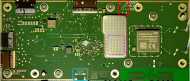

# Hardware

## PCBs
Interior of the Echo Show 15:

- 🔴: [Main Logic Board](#main-logic-board-mlb)
- 🟢: Buttons, camera cover slider, microphone array
- 🟡: IO board: Powermanagement, audio-processing, location of Micro-USB port
- 🔵: Microphone array

### Main Logic Board (MLB)

#### Front

- 🟣: [eMMC](./emmc.md) (under shield)
    - **Manufacturer**: SanDisk
    - **Model**: SanDisk iNAND 7250 (SDINBDG4-16G)
    - **Imprint**: SDINBDG4-16G / CHINA / 1437DPJDT1RJ
    - **Capacity**: 16GB
    - **Pinout**: BGA-153
- 🔵: [Micro HDMI](./micro-hdmi.md) pads
- 🔴: [UART](./uart.md) pads

<b>Show board of FCC report for comparison</b>

#### Back

- 🟢: RAM
    - Left
        - **Manufacturer**: Samsung
        - **Imprint**: SEC 131 / K4U8E3S / 4AOMGCL / G7E0739R
    - Right
        - **Manufacturer**: Samsung
        - **Imprint**: SEC 125 / K4UGE3S / 4AAMGCL / GHE123GUS
- 🟠: SoC:
    - **Manufacturer**: Amlogic
    - **Model**: POP1-C
    - **Imprint**: @mlogic / POP1-C / M1H489.00 / B02137N115B0
- 🔵: Area of [eMMC pinout](./emmc.md#interface-on-pcb)

## Various Observations

### Microphones
When disconnecting the separate microphone boards, the _Echo Show 15_ starts
without any issues or notifications, regardless of whether only one microphone
is disconnected or all three.

### Camera
When disconnecting the separate camera board, the _Echo Show 15_ starts without
any issues or notifications. One can even "take a photo", which results in a
black picture.