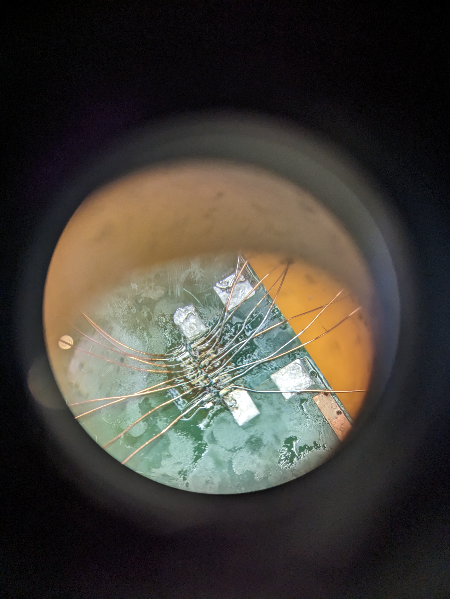
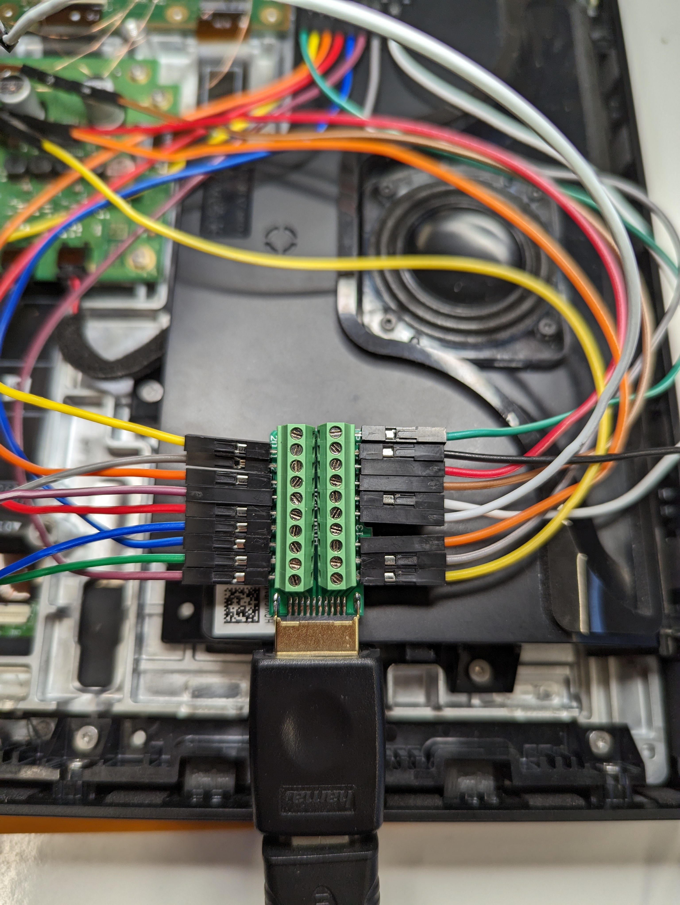

# Micro HDMI Port

As shown on the [Hardware](./hardware.md#main-logic-board-mlb) page, a
Micro HDMI solder pad is present on the Main Logic Board.

During an attempt to solder a Micro HDMI port to the exposed contacts we
damaged one of the solder pads, namely the CEC pad.
Luckily, this channel is not required according to the HDMI specification.

As we did not succeed in soldering an entire Micro HDMI port to the pads,
we soldered enamelled copper wire to each pad and connected them to an
HDMI breakout board.

<table>
<tr>
<td>

</td><td>

</td>
</tr>
</table>

We connected a display to the HDMI breakout board to see if the Echo Show 15
would show any output, but it remained dark.
Also, after connecting a video source there was no reaction.