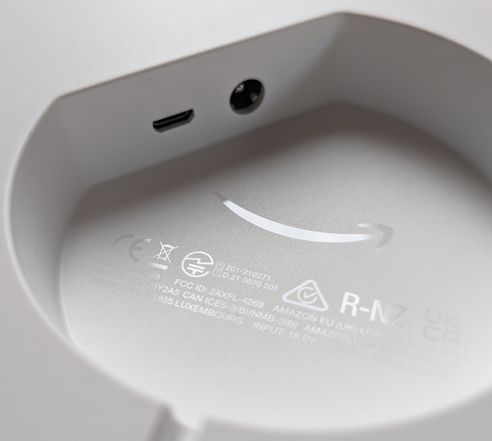

# Micro USB Port

<a href="./assets/micro-usb_and_power_jack.jpg">

</a>

The Echo Show 15 has a Micro-USB port on the back next to the power jack.
When connected to a computer, it does not appear in `lsusb`.

For Echo devices a button combination was identified, to boot them into the
*Android Fastboot mode* ([medium.com][medium:micaksica:fastboot]).
Press *Power-button* + *Volume down* for around 4 seconds.
The Amazon logo should appear on the screen.

**ATTENTION**: The button combination for a **factory reset** is
*Power-button* + *Volume up* + *Volume down*!

## lsusb

The Echo Show 15 should now be listed in `lsusb`:

```
$ lsusb -v
Bus 002 Device 080: ID 18d1:0d02 Google Inc. Celkon A88
Device Descriptor:
  bLength                18
  bDescriptorType         1
  bcdUSB               2.00
  bDeviceClass            0 
  bDeviceSubClass         0 
  bDeviceProtocol         0 
  bMaxPacketSize0        64
  idVendor           0x18d1 Google Inc.
  idProduct          0x0d02 Celkon A88
  bcdDevice           99.99
  iManufacturer           1 Amlogic
  iProduct                2 USB download gadget
  iSerial                 3 {REDACTED: serialnumber}
  bNumConfigurations      1
  Configuration Descriptor:
    bLength                 9
    bDescriptorType         2
    wTotalLength       0x0020
    bNumInterfaces          1
    bConfigurationValue     1
    iConfiguration          2 USB download gadget
    bmAttributes         0xc0
      Self Powered
    MaxPower              500mA
    Interface Descriptor:
      bLength                 9
      bDescriptorType         4
      bInterfaceNumber        0
      bAlternateSetting       0
      bNumEndpoints           2
      bInterfaceClass       255 Vendor Specific Class
      bInterfaceSubClass     66 
      bInterfaceProtocol      3 
      iInterface              4 Android Fastboot
      Endpoint Descriptor:
        bLength                 7
        bDescriptorType         5
        bEndpointAddress     0x81  EP 1 IN
        bmAttributes            2
          Transfer Type            Bulk
          Synch Type               None
          Usage Type               Data
        wMaxPacketSize     0x0200  1x 512 bytes
        bInterval               0
      Endpoint Descriptor:
        bLength                 7
        bDescriptorType         5
        bEndpointAddress     0x01  EP 1 OUT
        bmAttributes            2
          Transfer Type            Bulk
          Synch Type               None
          Usage Type               Data
        wMaxPacketSize     0x0200  1x 512 bytes
        bInterval               0
Device Qualifier (for other device speed):
  bLength                10
  bDescriptorType         6
  bcdUSB               2.00
  bDeviceClass            0 
  bDeviceSubClass         0 
  bDeviceProtocol         0 
  bMaxPacketSize0        64
  bNumConfigurations      1
Device Status:     0x0001
  Self Powered
```

The names assigned to the values of _idVendor_ and _idProduct_ do not match the
_Echo Show 15_, because `lsusb` uses, according to the man-pages, the file
`/usr/share/hwdata/usb.ids` for assigning the _ids_ to a manufacturer and
device name. This file is maintained by
[linux-usb.org](http://www.linux-usb.org/usb.ids).

`dmesg`-output when _Echo Show_ is connected to USB while in _fastboot mode_:
```
[449200.086435] usb 2-2: new full-speed USB device number 20 using xhci_hcd
[449200.200447] usb 2-2: device descriptor read/64, error -71
[449200.416497] usb 2-2: device descriptor read/64, error -71
[449200.834450] usb 2-2: new high-speed USB device number 21 using xhci_hcd
[449200.974615] usb 2-2: New USB device found, idVendor=18d1, idProduct=0d02, bcdDevice=99.99
[449200.974630] usb 2-2: New USB device strings: Mfr=1, Product=2, SerialNumber=3
[449200.974637] usb 2-2: Product: USB download gadget
[449200.974641] usb 2-2: Manufacturer: Amlogic
[449200.974645] usb 2-2: SerialNumber: {REDACTED: serialnumber}
[451034.868913] usb 2-2: USB disconnect, device number 21
```

## Fastboot

```
$ sudo fastboot devices
{REDACTED: serialnumber}	Android Fastboot
```

```
$ sudo fastboot getvar all
(bootloader) version-baseband: N/A
(bootloader) version-bootloader: 01.01.220125.215459
(bootloader) version: 0.4
(bootloader) hw-revision: 0
(bootloader) downloadsize: 0x08000000
(bootloader) serialno: {REDACTED: serialnumber}
(bootloader) product: hoya
(bootloader) off-mode-charge: 0
(bootloader) variant: US
(bootloader) battery-soc-ok: yes
(bootloader) battery-voltage: 4
(bootloader) partition-type:boot: raw
(bootloader) partition-size:boot: 0x0000000001800000
(bootloader) partition-type:system: ext4
(bootloader) partition-size:system: 0x00000000c2000000
(bootloader) partition-type:vendor: ext4
(bootloader) partition-size:vendor: 0x0000000012c00000
(bootloader) partition-type:odm: ext4
(bootloader) partition-size:odm: 0x0000000000800000
(bootloader) partition-type:data: ext4
(bootloader) partition-size:data: 0x00000002ad800000
(bootloader) block-size: 2000
(bootloader) block-size: 2000
(bootloader) secure: yes
(bootloader) unlocked: yes
(bootloader) unlock_code: {REDACTED}
(bootloader) unlock_status: 0
(bootloader) device_scs_vers: 1
(bootloader) device_tee_vers: 1
```

Partial partition table provided by the fastboot variables
(the full partition table was found on the [eMMC](./emmc.md#partitions)):
|Label |Type|Size (MB)|
|---   |--- |---      |
|boot  |raw |24       |
|system|ext4|3104     |
|vendor|ext4|300      |
|odm   |ext4|8        |
|data  |ext4|10968    |


```
$ sudo fastboot flashing get_unlock_ability
FAILED (remote: 'FAILblocked command')
fastboot: error: Command failed

$ sudo fastboot flashing unlock
FAILED (remote: 'FAILblocked command')
fastboot: error: Command failed

$ sudo fastboot oem unlock
FAILED (remote: 'FAILblocked command')
fastboot: error: Command failed
```

<!-- LINKS -->
[medium:micaksica:fastboot]: https://medium.com/@micaksica/c7e0f9408b59