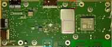

# UART

## Connection Settings
<a href="./assets/pcb_mlb_front_marks.svg">

</a>

To establish a UART connection needle probes were placed on the UART solder pads (🔴) on the Main Logic Board, and a UART-to-USB adapter was used with
`screen` and the following settings:
- **Voltage**: 3.3V
- **Baud rate**: 921600 *(8N1: 8 data bits, no parity bit and 1 stop bit)*

## Output
During startup a boot log is printed:

<details>
<summary><b>Show boot log</b></summary>

```
T7:BL:055c20;ID:9056101148721317;FEAT:3FF0F0F:1FC30400:B002F:1;POC:FF;RCY:0;OVD:0;DFU:0;eMMC:0;RD-0:0;CHK:0;SCS:0;

Bl2_early_platform_setup: indicates bl2ex flow!

OTP_LIC00 : 0f0fff030004c31f2f000b0000000000
OTP_LIC10 : 02a207000001fc000000000000000300
OTP_LIC20 : 0000000000fc0700ff80008003000000
OTP_LIC30 : 00000000010000008f03000003000000

TE: 282197

BL2 Built:15:10:20, Oct 12 2021.t7-griscure-review-sc2-bl2-10272020-2-92-gb0f9f2f-jenkins@walle02-sh

Board ID = 8
Set sys clock to 24Mhz
syspll is 1512Mhz. Locked
sys1pll is 1608Mhz. Locked
Set sys clock to 167Mhz
gp0pll is 0Mhz. Locked
bl2_platform_setup
boot area list: 
1STBLOB	00000200	00040000
BL2E	00040200	00013000
BL2X	00053200	00011000
DDRFIP	00064200	00040000
DEVFIP	000a4200	00300000
s_setup from rom:00010081
dma mode
derive RSPK OK
DDR driver_vesion: AML_S_PHY_V_1_8 build time: Oct 12 2021 15:10:13
ddr id: 0
ddr clk to 2112MHz
PIEI done
Cfg max: 2, cur: 1. Board id: 255. Force loop cfg
LPDDR4 probe
ddr clk to 2112MHz
Check phy result
INFO : End of CA training
INFO : End of initialization
INFO : Training has run successfully!
Check phy result
INFO : End of initialization
INFO : End of read enable training
INFO : End of fine write leveling
INFO : End of read dq deskew training
INFO : End of MPR read delay center optimization
INFO : End of Write leveling coarse delay
INFO : End of write delay center optimization
INFO : End of read delay center optimization
INFO : End of max read latency training
INFO : Training has run successfully!
ch0 1D training succeed
Check phy result
INFO : End of CA training
INFO : End of initialization
INFO : Training has run successfully!
Check phy result
INFO : End of initialization
INFO : End of read enable training
INFO : End of fine write leveling
INFO : End of read dq deskew training
INFO : End of MPR read delay center optimization
INFO : End of Write leveling coarse delay
INFO : End of write delay center optimization
INFO : End of read delay center optimization
INFO : End of max read latency training
INFO : Training has run successfully!
ch1 1D training succeed
Check phy result
INFO : End of initialization
INFO : End of 2D write delay Voltage center optimization
INFO : End of 2D write delay Voltage center optimization
INFO : End of 2D read delay Voltage center optimization
INFO : End of 2D read delay Voltage center optimization
INFO : Training has run successfully!
2d_training Time: 164761 us

R0_Rx=9 steps R0_Tx=9 steps Vref_Margin_R0=17 Dramvref_Margin_R0=23
R0_Rx=9 steps R0_Tx=10 steps Vref_Margin_R0=18 Dramvref_Margin_R0=24
soc_vref_reg_value 0x 0000001d 0000001d 0000001d 0000001d 0000001b 0000001c 0000001c 0000001d 0000001d 0000001c 0000001d 0000001c 0000001c 0000001d 0000001d 0000001c 0000001f 0000001e 0000001e 0000001e 00000020 0000001e 0000001f 0000001e 0000001e 0000001d 0000001f 0000001d 0000001e 0000001d 0000001c 0000001d
dram_verdor_id=00000001 dram_vref_reg_value 0x 0000000a
Ch0 2D training succeed
Check phy result
INFO : End of initialization
INFO : End of 2D write delay Voltage center optimization
INFO : End of 2D write delay Voltage center optimization
INFO : End of 2D read delay Voltage center optimization
INFO : End of 2D read delay Voltage center optimization
INFO : Training has run successfully!
2d_training Time: 160907 us

R0_Rx=9 steps R0_Tx=10 steps Vref_Margin_R0=18 Dramvref_Margin_R0=21
R0_Rx=11 steps R0_Tx=10 steps Vref_Margin_R0=18 Dramvref_Margin_R0=22
soc_vref_reg_value 0x 00000022 00000020 00000021 00000021 00000021 00000022 00000023 00000022 00000020 00000022 00000021 00000021 00000022 00000020 00000021 00000020 00000022 00000022 00000022 00000021 00000021 00000022 00000021 00000021 00000021 0000001f 00000023 00000023 00000022 00000021 00000022 00000021
dram_verdor_id=00000001 dram_vref_reg_value 0x 0000000a
ch1 2D training succeed

100bdlr_step_size ps== 401

100bdlr_step_size ps== 401

finnal_config_axi
finnal_config_axiset_cci_config:
cpu0_gic_init done
start ao cpu:
Wait AO...done.
debug_read..
SYSCTRL_CCI_CFG1==ffff3fff
SYSCTRL_CCI_CFG9==aaaaaaaa
SYSCTRL_NOC_CFG0==00000000
dram_size_config==04000800ap ao cmd ok
DDR cs0 size: 2048MB
DDR cs1 size: 0MB
DMC_DDR_CTRL: 00c00054DDR size: 2048MB
DDR cs0 size: 1024MB
DDR cs1 size: 0MB
DMC_DDR_CTRL: 00c00053DDR size: 1024MB
result report
boot times 0
non-sec scramble use random key
scramble use random key
ddr scramble enabled

INFO: bl2_load_bl2ex start!
INFO: load ...
Load: BL2E From: eMMC - 3.0 src: 00002000, dst: 00fffff0, size: 00011000
sdemmc src: ;
INFO: check ...
SHA CHK OK!

aml log : dump from buffer 01000000
35 0a b6 be 95 48 e8 a6 66 7d f7 5b cb 0a b9 dd
d2 bb e4 85 a4 87 d4 05 4a 1e 7b a9 fd 3f a0 af

INFO: load ...
Load: BL2X From: eMMC - 3.0 src: 00000000, dst: 007ffff0, size: 00011000
sdemmc src: ;
INFO: check ...
SHA CHK OK!

aml log : dump from buffer 00800000
32 8c 47 6b 36 0d d1 13 49 06 1e 4f 57 c9 da 03
e3 47 41 73 49 ba 40 3a 31 cb 08 2b f8 ae 31 6c

info: get valid params from BL2 !
BL2E: do things as vendor specific ... 
Hello world, now in BL2E

TE: 792034

BL2E Built : 21:09:24, Oct 18 2021. t7 g3f812c8 - jenkins@walle02-sh


 Start to do bl2e platform setup !
boot area list: 
1STBLOB	00000200	00040000
BL2E	00040200	00013000
BL2X	00053200	00011000
DDRFIP	00064200	00040000
DEVFIP	000a4200	00300000
eMMC boot @ 0
sw-hs2 s
tun-w: s=1, sz=4
sw8 s
aml log : BL2E load BL3X.....

TE: 805321
Load FIP HDR from eMMC, src: 0x00000000, des: 0x00200000, size: 0x00008000, part: 0
Load BL3X from eMMC, src: 0x00008000, des: 0x00208000, size: 0x0026c260, part: 0
bl30 payload size: 0x00010260
bl30 memcpy 
info: process payload 0  bl3x_toc: 0x00200020  bl3x_data: 0x00208000  rc=150
bl40 payload size: 0x00018470
info: process payload 1  bl3x_toc: 0x00200048  bl3x_data: 0x00219000  rc=194
bl31 payload size: 0x00040470
info: process payload 2  bl3x_toc: 0x00200070  bl3x_data: 0x00232000  rc=217
bl32 payload size: 0x00080470
info: process payload 3  bl3x_toc: 0x00200098  bl3x_data: 0x00273000  rc=252
bl33 memcpy
bl33 payload size: 0x00180260 offset: 0x000f4000
info: process payload 4  bl3x_toc: 0x002000c0  bl3x_data: 0x002f4000  rc=276
info: process payload 5  bl3x_toc: 0x002000e8  bl3x_data: 0x002001e0  rc=150
info: process payload 6  bl3x_toc: 0x00200110  bl3x_data: 0x00200fe0  rc=194
info: process payload 7  bl3x_toc: 0x00200138  bl3x_data: 0x00201de0  rc=217
info: process payload 8  bl3x_toc: 0x00200160  bl3x_data: 0x00202be0  rc=252
info: process payload 9  bl3x_toc: 0x00200188  bl3x_data: 0x002039e0  rc=276
info: process payload 10  bl3x_toc: 0x002001b0  bl3x_data: 0x002047e0  rc=324
aml log : BL2E loading BL3X is done...!
boot bl2x
params to bl2x, address=0x0100c190


 Hello, we are in BL2X world !

TE: 1067796

BL2X Built : 11:39:09, Apr 13 2021. t7 griscure-review-s4-bl2x-04052021-2-g5f3dc17 - jenkins@walle02-sh

bl2_platform_setup
INFO: get valid list_blobinfo, 0x0100c190
Info: get valid bl31 payload info, address= 0x00232000 size= 0x00040470
Info: bl31 image is now ready !
Info: get valid bl40 payload info, address= 0x00219000 size= 0x00018470

FEAT_DISABLE_SECURE_ENCLAVE: 0
Run secpu ... Result:  H_OKAY
bl2e_2 entry: 01000088
run into bl31
NOTICE:  BL31: v1.3(release):1f07d047d
NOTICE:  BL31: Built : 15:29:50, Jun 29 2021
BL31:tsensor calibration: tsensor1 = 960000c9
BL31:tsensor calibration: tsensor2 = 96000113
BL31:tsensor calibration: tsensor3 = 96000107
BL31:tsensor calibration: tsensor4 = 96000107
BL31:tsensor calibration: tsensor5 = 96000103
BL31:tsensor calibration: tsensor6 = 960000f1
[mhu]: mhu_init-v1
[mhu]: 0xfe007100, 0x12120210
[mhu]: 0xfe007104, 0x12121002
[mhu]: 0xfe00710c, 0xa0a0802
[mhu]: 0xfe007118, 0x12120210
[mhu]: 0xfe00711c, 0x12121002
[mhu]: 0xfe007120, 0x10101010
[mhu]: 0xfe007124, 0x10101010
[mhu]: 0xfe007020, 0x3
[mhu]: 0xfe007028, 0x10
[mhu]: 0xfe007024, 0x8
[mhu]: 0xfe00702c, 0x10
[mhu]: 0xfe007040, 0x9089
[mhu]: 0xfe007044, 0x0
[mhu]: 0xfe007048, 0x660
[mhu]: 0xfe00704c, 0x0
[mhu]: 0xfe007050, 0x90006
[mhu]: 0xfe007054, 0x0
[mhu]: 0xfe007058, 0x66000
[mhu]: 0xfe00705c, 0x0
[mhu]: mhu_init-v1 1230 done
DEVICE_MVN=0x1010100
E/TC:0 00 INFO:    BL3-2: ATOS-V3.8.0-5ec396d6a-dirty (gcc version 8.3.0 (GNU Toolchain for the A-profile Architecture 8.3-2019.03 (arm-rel-8.36))) #1 Mon Aug 29 08:25:41 UTC 2022 arm
E/TC:0 00 INFO:    BL3-2: secure time TEE
E/TC:0 00 INFO:    BL3-2: Chip: T7 Rev: B (36:B - 0:3)
Hello world again, bl2e meet you guys!
valid entry info for bl33, pc = 0x00000000
======== smc start aocpu ========
set i2c_ao_a pinmux

Starting AOCPU FreeRTOS...
AOCPU image version='(no fbda8b468888071f7e0f4e52e16a01ce32bd470a 20:27:36 2022-10-11'
AOCPU_IRQ_SEL=0x0
AOCPU_IRQ_SEL=0x0
AOCPU_IRQ_SEL=0x0
AOCPU_IRQ_SEL=0x0
[AOCPU]: mailbox init start
reg idx=0 cmd=6 handler=f71f14bc
reg idx=1 cmd=7 handler=f71f14a6
[AOCPU]: mailbox init end
Starting timer ...
reg idx=2 cmd=b4 handler=f71f1f56
reg idx=3 cmd=b6 handler=f71f1e8e
reg idx=4 cmd=11 handler=f71f1c50
reg idx=5 cmd=12 handler=f71f1c8c
reg idx=6 cmd=4 handler=f71f5574
reg idx=7 cmd=30 handler=f71f5560
reg idx=8 cmd=31 handler=f71f5570
Starting task scheduler ...
boot bl33 !
env_init: Environment nowhere init done (ret=0)


U-Boot 2019.01 (Oct 11 2022 - 20:27:13 +0000), Build: jenkins-fireos_main_pie-patch-build-193097

DRAM:  3 GiB
Relocation Offset is: bf652000
Relocating to bf652000, new gd at bb641dc8, sp at bb641db0
board init
watchdog disable
voldown_pullup_en
[meson_mmc_probe]sd: Controller probe success!
[meson_mmc_probe]emmc: Controller probe success!
emmc: resp timeout, cmd8, status=0x1ff2800
emmc: resp timeout, cmd55, status=0x1ff2800
store flag: 0, types: 1
emmc init success!
boot_device:1
boot_seq:0
boot_bakups:3
rebuid_id :0
boot area list: 
       bl2           200         40000
      bl2e         40200         13000
      bl2x         53200         11000
    ddrfip         64200         40000
    devfip         a4200        300000
emmc: tuning start:
emmc: best_win_start =1, best_win_size =5
mmc_device_init()-1318: get partition table from dtb failed
_check_ptbl_mbr()-878: MBR is OK!
crc32_s:0x1577dad == storage crc_pattern:0x1577dad!!!
crc32_s:0xee152b83 == storage crc_pattern:0xee152b83!!!
crc32_s:0x79f50f07 == storage crc_pattern:0x79f50f07!!!
emmc probe success
In:    serial@8000
Out:   serial@8000
Err:   serial@8000
idme_initialize
idme_platform_read block_offset=3e7000, capacity=400000
Idme version is 2.x and set related function to V2.x
IDME table version 2.1
idme_platform_write block_offset=3e7000, capacity=400000
MMC: block number 0x12001 exceeds max(0x2000)
bootcount = 119board late init
upgrade_step 0
CONFIG_AVB2: null 
Start read misc partition datas!
active slot = 0
set vendor_boot_mode false
      Amlogic Multi-DTB tool
      Multi DTB detected.
      Multi DTB tool version: v2.
      Support 5 DTBS.
Current chip version is:0xb.
SARADC mode is average
SARADC channel(1) is 664.
IDME board_id = 01D0001400010021
      Found DTB for "t7_hoya_pvt"
aml_get_virtual_partition_by_name()-1573: do not find match in table        dtb
the dtb partition size is:1680d8   byte
aml_get_virtual_partition_by_name()-1573: do not find match in table        dtb
error partition name!
Err imgread(L274):Fail read dtb from rsv with sz 0x1680d8
      Amlogic Multi-DTB tool
      Single DTB detected
detect ID pin : Host mode  , r2.b.iddig_curr=1
vpu: find AML_VPU_CLK_LEVEL_DFT: 7
vpu: clk_level in dts: 7
vpu: vpu_power_on_new
vpu: set clk: 666667000Hz, readback: 666666667Hz(0x100)
vpu: vpu_module_init_config
vpp: vpp_init, chip_id=54
vpp: g12a/b osd1 matrix rgb2yuv ..............
vpp: g12a/b osd2 matrix rgb2yuv..............
vpp: g12a/b osd3 matrix rgb2yuv..............
vpp: T7 osd4 matrix rgb2yuv..............
hdr_func: 4, hdr_process_select 0x1
hdr_func: 5, hdr_process_select 0x1
hdr_func: 64, hdr_process_select 0x1
hdr_func: 1, hdr_process_select 0x1
hdr_func: 2, hdr_process_select 0x1
lcd: lcd_debug_print flag: 0
lcd: lcd_debug_para: 3,bsp
lcd: [0]: detect mode: tablet, key_valid: 0, clk_path: 0
lcd: config load from bsp
lcd: [0]: use default panel_type=edp_0
lcd: [0]: edp_0, edp, 8bit, 1920x1080
bl: [0]: name: edp_0, method: 1
bl: [0]: bl_off_policy: none
gpiot3_pullup_en_disable
gpiot5_pulldown_en_disable
GPIOD_11 disable pullen
reboot_mode :::: cold_boot
cmd_inventory: probed in 33174 us
cmd_inventory: using profile 0
cmd_inventory: IDME dev_flags is 0
cmd_inventory: The IDME dev_flags bit 19 is cleared
cmd_inventory: The factory reset on the device is enabled
orientation :::: 0
bl_status ::::
[OSD]load fb addr from dts:/fb
[OSD]set initrd_high: 0x3f800000
[OSD]fb_addr for logo: 0x3f800000
[OSD]load fb addr from dts:/fb
[OSD]fb_addr for logo: 0x3f800000
[OSD]VPP_OFIFO_SIZE:0xfff01fff
[OSD]osd_hw.free_dst_data: 0,1919,0,1079
[OSD]osd1_update_disp_freescale_enable
vpp: vpp_matrix_update: 0
vpp: g12a/b post2(bit12) matrix: YUV limit -> RGB ..............
lcd: [0]: enable: edp_0, edp, 1920x1080@60.00Hz
lcd: [0]: tablet driver init(ver 20210409): edp
lcd: lcd_pll_wait_lock: pll_lock=1, wait_loop=1
lcd: [0]: edp power domain on
lcd: [0]: edp HPD state: 1, i=1
lcd: [0]: edp enable main stream video
bl: set level: 90, last level is: 0
bl: bl_power_ctrl: 1
lcd: [0]: clear lcd mute
recovery_status=
upgrade_step=0
Command: bcb uboot-command 
Start read misc partition datas!
BCB hasn't any datas,exit!
reboot_mode : cold_boot
Hit Enter key to stop autoboot:  0 
4096 bytes read in 1 ms (3.9 MiB/s)
CONFIG_SYSTEM_AS_ROOT: systemroot 
system_mode in storeboot: 1
Start read misc partition datas!
active slot = 0
set vendor_boot_mode false
CONFIG_AVB2: null 
active_slot in storeboot: normal
aml log : addr = 0x1080000
Certificate authenticated
==============
Image Metadata
==============
product:hoya
signer:CodeSigner
Image AUTHENTICATED with PRODUCTION certificate
avb2: 0
avb2: 0
## Booting Android Image at 0x01080000 ...
reloc_addr =bb75cde0
copy done
Kernel load addr 0x01080000 size 9996 KiB
Kernel command line: androidboot.dtbo_idx=0 buildvariant=user veritykeyid=id:{REDACTED: 40-char-hex-value}
load bootimage dtb from 0xbc1205e0 ......
      Amlogic Multi-DTB tool
      Multi DTB detected.
      Multi DTB tool version: v2.
      Support 5 DTBS.
Current chip version is:0xb.
SARADC mode is average
SARADC channel(1) is 663.
IDME board_id = 01D0001400010021
      Found DTB for "t7_hoya_pvt"
env select addr: 0x0x1000000
## Flattened Device Tree blob at 01000000
   Booting using the fdt blob at 0x1000000
   Uncompressing Kernel Image ... OK
[rsvmem] no check for rsvmem, should check int kernel
   Loading Device Tree to 000000001ffe6000, end 000000001ffff4b4 ... OK
begin amzn fdt fixup
Boot mode is 1
finish amzn fdt fixup
IDME inserted into FDT

Starting kernel ...

uboot time: 3258570 us
boot 64bit kernel
read_ao no reg:0x11
[cec_get_portinfo]: info=0x0
DSP_REMAP2  is f7004200 
dsp init start
start_dsp
P_DSP_RESET_VEC =42000000
P_DSP_SEC_CFG0 =7
P_DSP_CFG0 =20000000
boot dsp finished
```

</details>
<br />

The line "**Hit Enter key to stop autoboot**" indicates that the boot process
can be interrupted.
When the *Enter* key is pressed repeatedly directly after power on,
autoboot is stopped and the user is dropped into a bootloader shell.
Unfortunately all commands are blocked, even those that are suggested
by the shell itself when pressing the *Tab* key.

```
[...]
Command: bcb uboot-command 
Start read misc partition datas!
BCB hasn't any datas,exit!
reboot_mode : cold_boot
Hit Enter key to stop autoboot:  0 
hoya# id
I'm sorry, but command id is blocked
hoya# ls
I'm sorry, but command ls is blocked
hoya# whoami
Unknown command 'whoami' - try 'help'
hoya# help
I'm sorry, but command help is blocked
hoya# ?
I'm sorry, but command ? is blocked
hoya# test
I'm sorry, but command test is blocked
hoya# uname
Unknown command 'uname' - try 'help'
hoya# dir
Unknown command 'dir' - try 'help'
hoya# cd
Unknown command 'cd' - try 'help'
hoya# echo
I'm sorry, but command echo is blocked
hoya# printenv
I'm sorry, but command printenv is blocked
hoya# version
I'm sorry, but command version is blocked
hoya# env
I'm sorry, but command env is blocked
hoya# run
I'm sorry, but command run is blocked
hoya# <Tab key>
adnl amlbootsta amlmmc amlsecurecheck arbvers autoscr avb base bcb bl2_ver
  blkcache bmp boot boot_cooling bootd bootefi booti bootm ...
```